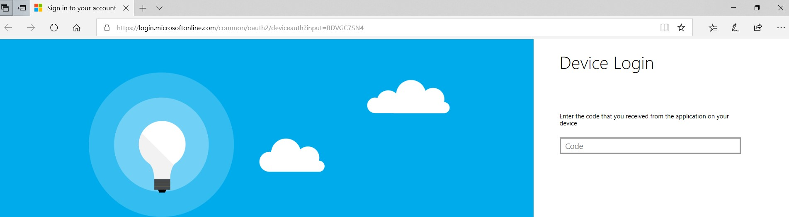
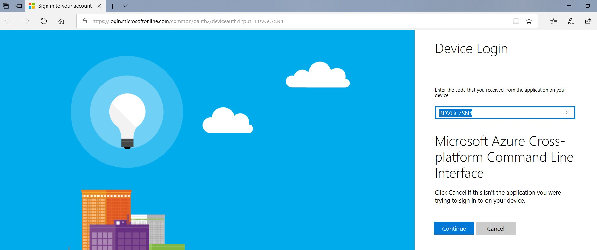

# Overview

This tool will return the total blob and file sizes for all storage accounts in an Azure subscription.  It uses the Azure Metrics API, i.e. it does not enumerate individual blobs.

# Installing dependencies

```
pip install azure==4.0.0 pandas>=0.24.1 enum34 humanfriendly
```

# Running the application

Run the following command:

```
python metrics-data.py
```

The application will ask you to log in; the following page will open in a browser:





Copy the <b>input code</b> from the browser URL:


Paste the <b>input code</b> into the code field:





Click "continue", after which you might be asked to log in again.  Once you see the following message in the browser, return to the command prompt:


Next you will be prompted to enter the name of the subscription that you would like to examine.  If the application was unable to find a subscription with the subscription name entered, you will be prompted to re-enter the subscription name. If the application was able to find a matching subscription it will continue with execution.


In your command prompt you should see the script enumerating storage accounts.


# Review results

Once the code has run successfully you should see a message like &ldquo;Metrics saved to file: metrics_03-06-19-125503.csv&rdquo;.

The metrics file will be saved in the same directory as the code.  Columns will be:

`Storage account, Resource group, Blob capacity, File capacity, Total capacity`

...with capacity values specified in bytes.  These represent the average storage consumed over the last 24 hours by each storage account, as recorded by Azure Metrics.


