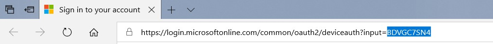
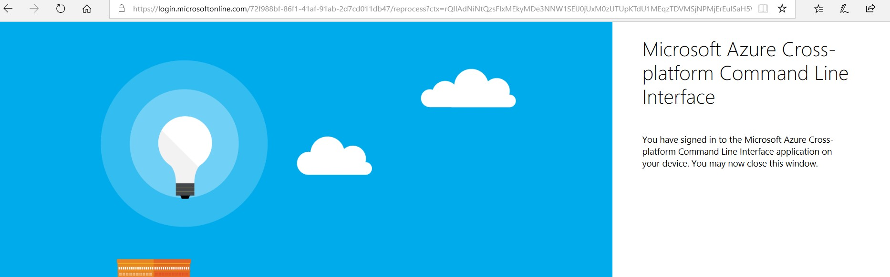

# Overview

This tool will return the total blob and file sizes for all storage accounts in an Azure subscription.

# Installing dependencies

```
pip install azure==4.0.0 
pip install --upgrade pip enum34
pip install humanfriendly
pip install logging
```

# Running the application

Run the following command:

```
python azure-data.py
```

The application will ask you to log in; the following page will open in a browser:


Copy the <b>input code</b> from the browser URL:





Enter the <b>input code</b> into the code field:


Click "continue", then you might be asked to log in again.  Once you see the following message in the browser, return to the command prompt:





Next you will be prompted to enter the name of the subscription that you would like to use. If the application was unable to find a subscription with the subscription name entered, you will be prompted to re-enter the subscription name.  If the application was able to find a matching subscription it will continue with execution and you should see the message <b>Program started on...</b>, followed by execution status reports.

The application will create the following log files in the "logs" folder (placed relative to the current working directory):

`/debug_logs/debug_%m_%d_%Y_%H_%M_%S.log`

This log file shows the execution status of the program, along with any errors that occurred during execution.

`/info_logs/blob_container_and_blob_sizes_%m_%d_%Y_%H_%M_%S.log`

This log files contains three fields:

1. blob name: name of the blob processed
2. size: size of the blob in bytes
2. size (friendly): human-readable size

This log will also show the total blob container size after each blob size has been recorded.

`/info_logs/storage_sizes_%m_%d_%Y_%H_%M_%S.log`

This logs shows the sizes for each of the storage accounts that were processed.


# Review results

Once the program has processed all storage accounts, each of the log files will display the following message:

`Program ended on: yyy-mm-dd HH:SS:##.######`

Once the following message is displayed in the logs, you can open the logs under the info_logs folder in Excel. Be careful not to open the log files in Excel until the program has finished execution; this will cause the program to fail, but you may view them in a text editor while the program is executing.

# Clean log folder

If you would like to clear the log folder, you can run the following command:

```
python cleanup-logs.py
```

