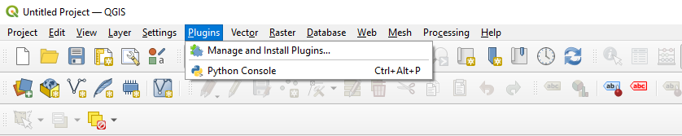
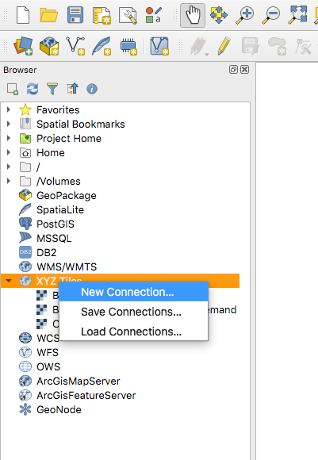
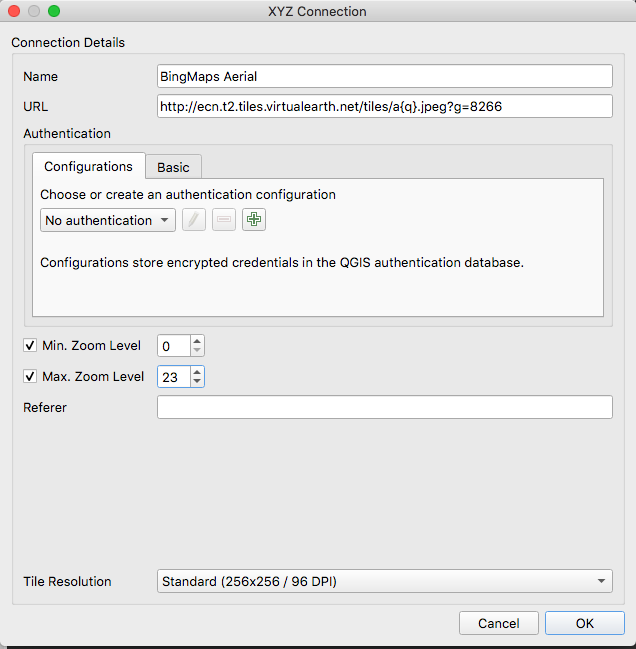
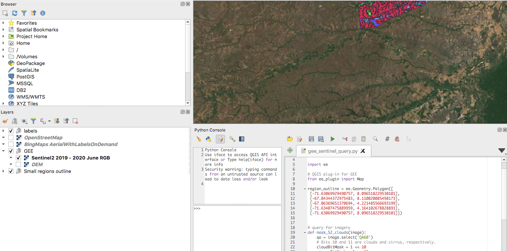

# QGIS recipes

Useful instructions for doing various operations in QGIS collected into one place.

## Adding a collections of free basemaps as XYZ tile layers

Instructions adapted from [here](https://opengislab.com/blog/2018/4/15/add-basemaps-in-qgis-30).

Steps:

1. Open the Python Console in QGIS by going to the "Plugins" dropdown menu and selecting on "Python Console":
  

2. Copy the script from https://github.com/klakar/QGIS_resources/blob/master/collections/Geosupportsystem/python/qgis_basemaps.py into the Python Console and run it. This will populate the "XYZ Tiles" section in the Browser with a variety of basemaps that you can add to your project.

## Adding a Bing Maps product as an XYZ tile layer

Prerequisites:

- [Postman](https://www.postman.com/) or another setup that will allow you to call an API. Your browser should also work.

- Also need a valid Bing Maps key. You can get a basic developer tier key by making an account at https://www.bingmapsportal.com/Application. Your key will appear in a table on this page once you succeed in making the account and getting a key.

Steps:

1. Use the Bing Maps [imagery metadata API](https://docs.microsoft.com/en-us/bingmaps/rest-services/imagery/get-imagery-metadata) to get the tile service URL, which is dynamic. 
  - Use the following URL, replace `<BingMapsKey>` with your key, and choose the type of imagery you’d like to see (example here is requesting `AerialWithLabelsOnDemand` - options are listed in the linked documentation). 
  ```
    http://dev.virtualearth.net/REST/V1/Imagery/Metadata/AerialWithLabelsOnDemand?output=json&include=ImageryProviders&key=<BingMapsKey>
  ```

2. GET with the completed URL, and the returned JSON should include the following field somewhere nested in there:
  ```
  "imageHeight": 256,
                  "imageUrl": "http://ecn.{subdomain}.tiles.virtualearth.net/tiles/a{quadkey}.jpeg?g=8266",
                  "imageUrlSubdomains": [
                      "t0",
                      "t1",
                      "t2",
                      "t3"
                  ],
                  "imageWidth": 256,
  ```

3. Copy the `imageUrl` field and select an `imageUrlSubdomain` (any will do)

4. In QGIS, in the Browser panel, add a New Connection to “XYZ Tiles" 

  

5. In the dialog, fill the URL with the `imageURL`, filling in the `imageUrlSubdomain` with a valid value, and also write “q” in the place of the Quadkey. 

  
  
6. Set the Tile Resolution to 256 and click "OK".

7. Add a layer of the connection type you just created to the project (by right-clicking on it under "XYZ tiles" and clicking "add layer to project")


## Adding a Google Earth Engine (GEE) queried map layer as an XYZ tile layer

Prerequisite: a GEE account. 

Installation and authentication instructions:
https://gee-community.github.io/qgis-earthengine-plugin/

In QGIS' Python Console or Editor, start with 

```python
import ee
from ee_plugin import Map
```

The result of a `Map.addLayer()` call will add the result as an XYZ tile layer to the current project. The name of the layer will be the name you designated in the `Map.addLayer()` call.

The following screenshot shows running a script to add a Sentinel-2 median composite over a time period as a layer.



